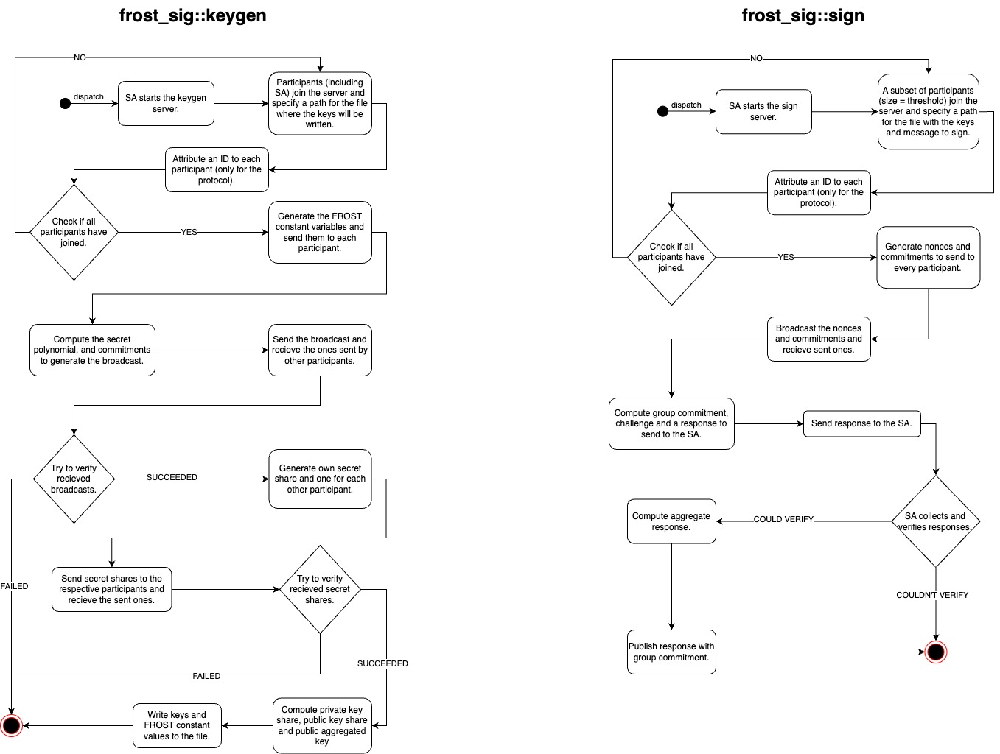

# frost-sig

`frost-sig` is a threshold signature library that implements the FROST protocol.

It uses [Risttretto](https://ristretto.group/) elliptic curve cryptography and the [Blake2](https://www.blake2.net/) hashing algorythm for computations.

## Features

- Key Generation.
- Preprocessing.
- Signing Transactions.
- Servers/Clients to use the protocol in a pratical setting.

## Usage Flow



## Dependencies

- `curve25519_dalek` is a crate for elliptic curve cryptography.
- `rand` is a random number generation crate and it is used to generate a random seed for the 256bit numbers generation.
- `serde` is a framework for serializing and deserializing Rust data structures efficiently and generically.
- `tokio` is a runtime for writting reliable async Rust code.

## Requirements

- Cargo installed

## Example
```Rust
use frost_sig::{client, server};
use std::error::Error;

#[tokio::main]
async fn main() -> Result<(), Box<dyn Error>> {
    let mode = std::env::args()
        .nth(1)
        .expect("Failed to give enough arguments.");
    let operation = std::env::args()
        .nth(2)
        .expect("Failed to give enough arguments.");

    match (mode.as_str(), operation.as_str()) {
        ("server", "keygen") => {
            let p = std::env::args()
                .nth(3)
                .expect("Failed to give enough arguments.")
                .parse::<u32>()
                .expect("Invalid arguments.");
            let t = std::env::args()
                .nth(4)
                .expect("Failed to give enough arguments.")
                .parse::<u32>()
                .expect("Invalid arguments.");
            server::keygen_server::run("localhost", 3333, p, t).await?;
        }
        ("client", "keygen") => {
            let path = std::env::args()
                .nth(3)
                .expect("Failed to give enough arguments.");
            client::keygen_client::run("localhost", 3333, &path).await?;
        }
        ("server", "sign") => {
            let p = std::env::args()
                .nth(3)
                .expect("Failed to give enough arguments.")
                .parse::<u32>()
                .expect("Invalid arguments.");
            let t = std::env::args()
                .nth(4)
                .expect("Failed to give enough arguments.")
                .parse::<u32>()
                .expect("Invalid arguments.");
            server::sign_server::run("localhost", 3333, p, t)
                .await
                .unwrap();
        }
        ("client", "sign") => {
            let path = std::env::args()
                .nth(3)
                .expect("Failed to give enough arguments.");
            client::sign_client::run("localhost", 3333, &path).await?;
        }
        _ => {
            eprintln!("Invalid arguments.");
        }
    }

    Ok(())
}
```

## Support

See the [resources](https://eprint.iacr.org/2020/852.pdf) here.
