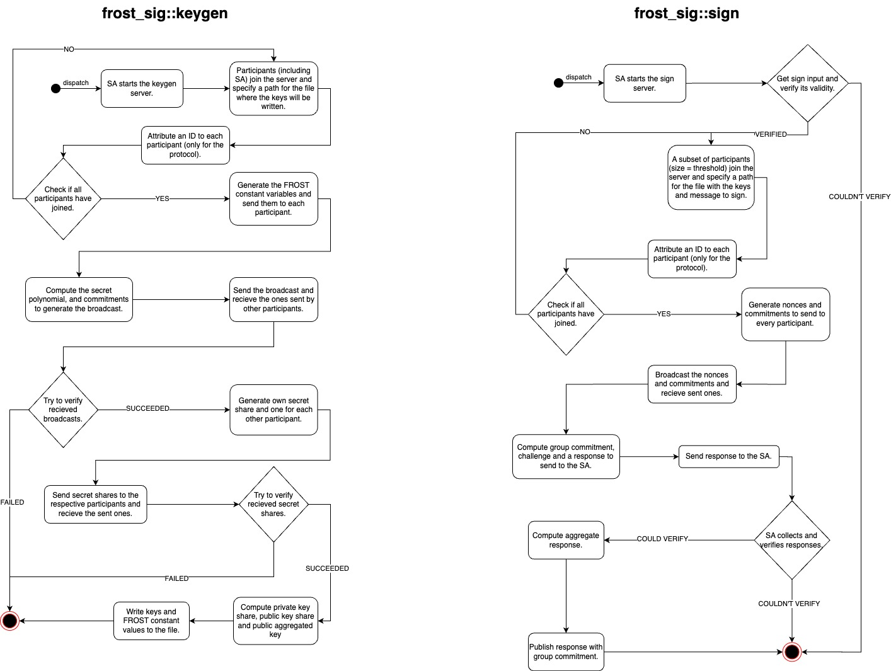

# frost-sig

`frost-sig` is a threshold signature library that implements the FROST protocol.

It uses [Risttretto](https://ristretto.group/) elliptic curve cryptography and the [Blake2](https://www.blake2.net/) hashing algorythm for computations.

## Features

- Key Generation.
- Preprocessing.
- Signing Transactions.
- Servers/Clients to use the protocol in a pratical setting.

## Usage Flow



## Dependencies

- `curve25519_dalek` is a crate for elliptic curve cryptography.
- `rand` is a random number generation crate and it is used to generate a random seed for the 256bit numbers generation.
- `serde` is a framework for serializing and deserializing Rust data structures efficiently and generically.
- `tokio` is a runtime for writting reliable async Rust code.

## Requirements

- Cargo installed

## Example

### Socket

This example shows how to use the `client` and `server` modules to create a socket for participant's to generate keys and sign transactions in a real-time CLI enviroment.

```Rust
use frost_sig::{client, server};
use std::error::Error;

#[tokio::main]
async fn main() -> Result<(), Box<dyn Error>> {
    let mode = std::env::args()
        .nth(1)
        .expect("Failed to give enough arguments.");
    let operation = std::env::args()
        .nth(2)
        .expect("Failed to give enough arguments.");

    match (mode.as_str(), operation.as_str()) {
        ("server", "keygen") => {
            let p = std::env::args()
                .nth(3)
                .expect("Failed to give enough arguments.")
                .parse::<u32>()
                .expect("Invalid arguments.");
            let t = std::env::args()
                .nth(4)
                .expect("Failed to give enough arguments.")
                .parse::<u32>()
                .expect("Invalid arguments.");
            server::keygen_server::run("localhost", 3333, p, t).await?;
        }
        ("client", "keygen") => {
            let path = std::env::args()
                .nth(3)
                .expect("Failed to give enough arguments.");
            client::keygen_client::run("localhost", 3333, &path).await?;
        }
        ("server", "sign") => {
            let p = std::env::args()
                .nth(3)
                .expect("Failed to give enough arguments.")
                .parse::<u32>()
                .expect("Invalid arguments.");
            let t = std::env::args()
                .nth(4)
                .expect("Failed to give enough arguments.")
                .parse::<u32>()
                .expect("Invalid arguments.");
            server::sign_server::run("localhost", 3333, p, t)
                .await
                .unwrap();
        }
        ("client", "sign") => {
            let path = std::env::args()
                .nth(3)
                .expect("Failed to give enough arguments.");
            client::sign_client::run("localhost", 3333, &path).await?;
        }
        _ => {
            eprintln!("Invalid arguments.");
        }
    }

    Ok(())
}
```

To run the program (`p` and `t` are the desired number of participants and the threshold):
```Bash
# for the keygen server
cargo run -- server keygen p t

# for the sign server
cargo run -- server keygen p t

# for the keygen client
cargo run -- server keygen p t

# for the keygen client (saves the keys in ex.json)
cargo run -- client keygen keys.json

# for the keygen client (gets the keys from ex.json)
cargo run -- client sign keys.json
```

### No Socket

First we initialize the random generator from the OS and the state with the correct number of participants and threshold.
```Rust
let mut rng = OsRng;
let state = crate::FrostState::new(3, 2);
```

Then we can start the keygen protocol's round 1. Each participant generates their own secret polynomial.
```Rust
let walter_polynomial = round_1::generate_polynomial(&state, &mut rng);
let jessie_polynomial = round_1::generate_polynomial(&state, &mut rng);
let skylar_polynomial = round_1::generate_polynomial(&state, &mut rng);
```
Each participant initializes their state.
```Rust
let walter = Participant::new(1, walter_polynomial);
let jessie = Participant::new(2, jessie_polynomial);
let skylar = Participant::new(3, skylar_polynomial);
```

Each participant computes their signature and commitment.
```Rust
let walter_signature = round_1::compute_proof_of_knowlodge(&mut rng, &walter);
let jessie_signature = round_1::compute_proof_of_knowlodge(&mut rng, &jessie);
let skylar_signature = round_1::compute_proof_of_knowlodge(&mut rng, &skylar);

let walter_commitments = round_1::compute_public_commitments(&walter);
let jessie_commitments = round_1::compute_public_commitments(&jessie);
let skylar_commitments = round_1::compute_public_commitments(&skylar);
```

Each participant sends the computed commitments and signature in a broadcast message.
```Rust
let walter_broadcast = Message::Broadcast {
    participant_id: walter.id.clone(),
    commitments: walter_commitments,
    signature: walter_signature,
};
let jessie_broadcast = Message::Broadcast {
    participant_id: jessie.id.clone(),
    commitments: jessie_commitments,
    signature: jessie_signature,
};
let skylar_broadcast = Message::Broadcast {
    participant_id: skylar.id.clone(),
    commitments: skylar_commitments,
    signature: skylar_signature,
};
```

Each participant verifies the broadcasts recieved from others, and we finishing round 1.
```Rust
assert!(round_1::verify_proofs(&[
    jessie_broadcast.clone(),
    skylar_broadcast.clone(),
]));
assert!(round_1::verify_proofs(&[
    walter_broadcast.clone(),
    skylar_broadcast.clone(),
]));
assert!(round_1::verify_proofs(&[
    walter_broadcast.clone(),
    jessie_broadcast.clone(),
]));
```

Then we begin round 2 by having each participant compute their secret share.
```Rust
let walter_own_share = round_2::create_own_secret_share(&walter);
let jessie_own_share = round_2::create_own_secret_share(&jessie);
let skylar_own_share = round_2::create_own_secret_share(&skylar);
```

Also each participant computes one for each other participant and send it to them (send through private channel).
```Rust
let share_from_skylar_to_walter = round_2::create_share_for(&skylar, &walter.id);
let share_from_jessie_to_walter = round_2::create_share_for(&jessie, &walter.id);

let share_from_skylar_to_jessie = round_2::create_share_for(&skylar, &jessie.id);
let share_from_walter_to_jessie = round_2::create_share_for(&walter, &jessie.id);

let share_from_jessie_to_skylar = round_2::create_share_for(&jessie, &skylar.id);
let share_from_walter_to_skylar = round_2::create_share_for(&walter, &skylar.id);
```

Each participant verifies the recieved secret shares.
```Rust
{
    assert!(round_2::verify_share_validity(
        &walter,
        &share_from_skylar_to_walter,
        &skylar_broadcast,
    ));
    assert!(round_2::verify_share_validity(
        &walter,
        &share_from_jessie_to_walter,
        &jessie_broadcast,
    ));
}
{
    assert!(round_2::verify_share_validity(
        &jessie,
        &share_from_skylar_to_jessie,
        &skylar_broadcast,
    ));
    assert!(round_2::verify_share_validity(
        &jessie,
        &share_from_walter_to_jessie,
        &walter_broadcast,
    ));
}
{
    assert!(round_2::verify_share_validity(
        &skylar,
        &share_from_walter_to_skylar,
        &walter_broadcast,
    ));
    assert!(round_2::verify_share_validity(
        &skylar,
        &share_from_jessie_to_skylar,
        &jessie_broadcast,
    ));
}
```

Each participant computes their private key.
```Rust
let walter_private_key = round_2::compute_private_key(
    &walter_own_share,
    &[
        share_from_jessie_to_walter.clone(),
        share_from_skylar_to_walter.clone(),
    ],
)
.unwrap();
let jessie_private_key = round_2::compute_private_key(
    &jessie_own_share,
    &[
        share_from_walter_to_jessie.clone(),
        share_from_skylar_to_jessie.clone(),
    ],
)
.unwrap();
let skylar_private_key = round_2::compute_private_key(
    &skylar_own_share,
    &[share_from_jessie_to_skylar, share_from_walter_to_skylar],
)
.unwrap();
```

Each participant computes their public key.
```Rust
let walter_public_key = round_2::compute_own_public_share(&walter_private_key);
let jessie_public_key = round_2::compute_own_public_share(&jessie_private_key);
let skylar_public_key = round_2::compute_own_public_share(&skylar_private_key);
```

Each participant computes their verification share and one for each broadcast recieved.
```Rust
let walter_own_verification_share =
    round_2::compute_participant_verification_share(&walter, &walter_broadcast).unwrap();
let walter_jessie_verification_share =
    round_2::compute_participant_verification_share(&walter, &jessie_broadcast).unwrap();
let walter_skylar_verification_share =
    round_2::compute_participant_verification_share(&walter, &skylar_broadcast).unwrap();

let jessie_own_verification_share =
    round_2::compute_participant_verification_share(&jessie, &jessie_broadcast).unwrap();
let jessie_walter_verification_share =
    round_2::compute_participant_verification_share(&jessie, &walter_broadcast).unwrap();
let jessie_skylar_verification_share =
    round_2::compute_participant_verification_share(&jessie, &skylar_broadcast).unwrap();

let skylar_own_verification_share =
    round_2::compute_participant_verification_share(&skylar, &skylar_broadcast).unwrap();
let skylar_jessie_verification_share =
    round_2::compute_participant_verification_share(&skylar, &jessie_broadcast).unwrap();
let skylar_walter_verification_share =
    round_2::compute_participant_verification_share(&skylar, &walter_broadcast).unwrap();
```

Each participant computes the aggregate verification share from the recieved secret shares.
```Rust
let walter_aggregate_verification_share = round_2::compute_others_verification_share(&[
    walter_own_verification_share,
    walter_jessie_verification_share,
    walter_skylar_verification_share,
]);
let jessie_aggregate_verification_share = round_2::compute_others_verification_share(&[
    jessie_own_verification_share,
    jessie_walter_verification_share,
    jessie_skylar_verification_share,
]);
let skylar_aggregate_verification_share = round_2::compute_others_verification_share(&[
    skylar_own_verification_share,
    skylar_walter_verification_share,
    skylar_jessie_verification_share,
]);
```

Each participant verifies if the public key matches the aggregate verification share.
```Rust
assert_eq!(walter_public_key, walter_aggregate_verification_share);
assert_eq!(jessie_public_key, jessie_aggregate_verification_share);
assert_eq!(skylar_public_key, skylar_aggregate_verification_share);
```

Each participant computes the group public key from the commitments and we finish the keygen protocol.
```Rust
let group_public_key =
    round_2::compute_group_public_key(&[walter_broadcast, jessie_broadcast, skylar_broadcast])?;
```

We begin the sign process by defining the message that will be signed and having each participant generate their one-time use nonces and commitments (because the threshold is 2 we will only use Walter and Skylar).
```Rust
let message = "Send Gustavo 10 bucks.";

let walter_commitments = generate_nonces_and_commitments(&mut rng);
let skylar_commitments = generate_nonces_and_commitments(&mut rng);
```

Each participant sends the commitments to others.
```Rust
let walter_commitments_message = Message::PublicCommitment {
    participant_id: walter.id.clone(),
    di: walter_commitments.1 .0.clone(),
    ei: walter_commitments.1 .1.clone(),
    public_share: walter_public_key,
};
let skylar_commitments_message = Message::PublicCommitment {
    participant_id: jessie.id.clone(),
    di: skylar_commitments.1 .0.clone(),
    ei: skylar_commitments.1 .1.clone(),
    public_share: skylar_public_key,
};
```

Each participant computes the group commitment and challenge from the recieved commitments.
```Rust
let (_group_commitment, challenge) = compute_group_commitment_and_challenge(
    &[
        skylar_commitments_message.clone(),
        walter_commitments_message.clone(),
    ],
    message,
    group_public_key.clone(),
)?;
```

Each participant calculates all the participants' lagrange coefficients.
```Rust
let walter_lagrange_coefficient = lagrange_coefficient(&state, &walter.id);
let skylar_lagrange_coefficient = lagrange_coefficient(&state, &jessie.id);
```

Each participant computes their response and sends to the SA.
```Rust
let walter_response = compute_own_response(
    walter.id.clone(),
    &walter_commitments_message,
    &walter_private_key,
    &walter_commitments.0,
    &walter_lagrange_coefficient,
    &challenge,
    &message,
)?;
let skylar_response = compute_own_response(
    jessie.id.clone(),
    &skylar_commitments_message,
    &skylar_private_key,
    &skylar_commitments.0,
    &skylar_lagrange_coefficient,
    &challenge,
    &message,
)?;
```

SA verifies others' responses.
```Rust
let verify_walter = verify_participant(
    &state,
    &walter_commitments_message,
    message,
    &walter_response,
    &challenge,
)?;
let verify_skylar = verify_participant(
    &state,
    &skylar_commitments_message,
    message,
    &skylar_response,
    &challenge,
)?;
assert!(verify_walter);
assert!(verify_skylar);
```

SA computes the aggregate response finishing the sign protocol.
```Rust
let _aggregate_response = compute_aggregate_response(&[walter_response, skylar_response])?;
```

## Support

See the [resources](https://eprint.iacr.org/2020/852.pdf) here.
