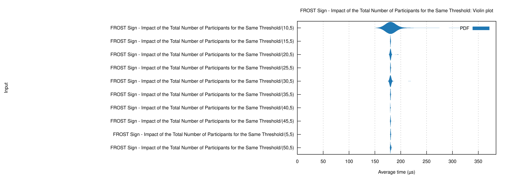
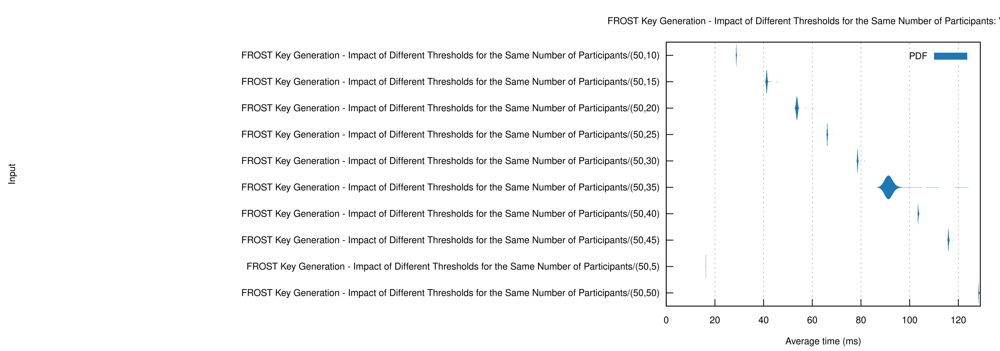
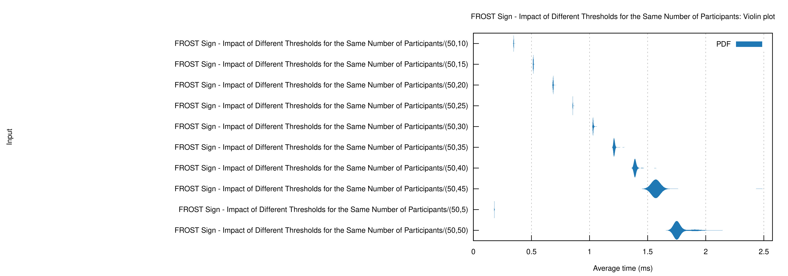

<a id="readme-top"></a>


<!-- PROJECT LOGO -->
<br />
<div align="center">
  <h3 align="center">frost-sig</h3>
  <p align="center">
    A threshold signature `crate` that implements FROST for Nano transactions
  </p>
</div>


<!-- TABLE OF CONTENTS -->
<details>
  <summary>Table of Contents</summary>
  <ol>
    <li>
      <a href="#about-the-project">About The Project</a>
      <ul>
        <li><a href="#built-with">Built With</a></li>
      </ul>
    </li>
    <li>
      <a href="#getting-started">Getting Started</a>
      <ul>
        <li><a href="#prerequisites">Prerequisites</a></li>
        <li><a href="#installation">Installation</a></li>
        <li><a href="#run-the-project">Run the Project</a></li>
        <li><a href="#documentation">Documentation</a></li>
        <li><a href="#benchmarks">Benchmarks</a></li>
      </ul>
    </li>
    <li>
      <a href="#usage">Usage</a>
      <ul>
        <li><a href="#flow">Flow</a></li>
        <li><a href="#socket">Socket</a></li>
        <li><a href="#frost">FROST</a></li>
      </ul>
    </li>
    <li><a href="#benchmarks">Benchmarks</a>
      <ul>
        <li><a href="#influence-of-the-number-of-total-participants">Influence of the Number of Total Participants</a></li>
        <li><a href="#influence-of-the-threshold">Influence of the Threshold</a></li>
      </ul>
    </li>
    <li><a href="#support">Support</a></li>
    <li><a href="#contributing">Contributing</a></li>
  </ol>
</details>


<!-- ABOUT THE PROJECT -->
## About The Project

`frost-sig` is a Rust `crate` that implements the **FROST** signature protocol for computing **threshold digital signatures** that are **secure**, **distributed**, and **low-latency**. This project was developed as the Final Project for my Computer Science degree at Universidade da Beira Interior under the guidance of Professor Doctor Paul Andrew Crocker. The complete research and implementation details can be found in the [report](https://github.com/diogogomesaraujo/aokiji/blob/main/report.pdf).

**What features does it provide?**
* **Key Generation**, **Preprocess**, and **Sign** building blocks that enable the creation of group accounts and collective message signing (such as transactions).
* **TCP Client/Server** implementations for generating keys and signing messages in distributed environments.
* Infrastructure for utilizing FROST's signature scheme to sign and publish transactions on Nano's blockchain.

To see `frost-sig` in action within a real-world application, check out [aokiji](https://github.com/diogogomesaraujo/aokiji), a digital wallet that leverages this `crate`.

<p align="right">(<a href="#readme-top">back to top</a>)</p>


### Built With

These are some of the tools used to build this application. They provided a strong foundation to assure its integrity and robustness.

* `curve25519_dalek` for elliptic curve cryptography.
* `ed25519-dalek-blake2b` for signature validation.
* `rand` for random number generation.
* `serde` for json serialization and deserialization.
* `hex` for hexadecimal serialization and deserialization.
* `tokio` for the TCP sockets implementation (multithreaded and async).
* `reqwest` for HTTP requests.

<p align="right">(<a href="#readme-top">back to top</a>)</p>


<!-- GETTING STARTED -->
## Getting Started

You can use this crate inside an already existing project by adding the following line to your `Cargo.toml` dependencies

```toml
frost-sig = { git = "https://github.com/diogogomesaraujo/frost-sig.git" }
```

Alternatively, you can run the project by following these steps.

### Prerequisites

In order to run build this application from source you will need to have `cargo` installed. To install it you can follow this [tutorial](https://www.rust-lang.org/tools/install) from Rust's official website.

### Installation
1. Clone the repository
   
   ```sh
   git clone https://github.com/diogogomesaraujo/frost-sig.git
   ```
2. Build the project
   
   ```sh
   cargo build
   ```

### Run the Project
1. Navigate to the project's directory
2. Run `main.rs`, a simple CLI application demonstrating the `crate`'s socket implementation
   
   ```sh
   cargo run
   ```

### Documentation
1. To build and open the documentation
   
   ```sh
   cargo doc --open
   ```

### Benchmarks
1. To run benchmarks measuring each participant's computation latency according to threshold and total number of participants
   
   ```sh
   cargo bench
   ```
3. To view the benchmark results, navigate to `./target/criterion/report` and open `index.html`

<p align="right">(<a href="#readme-top">back to top</a>)</p>


<!-- USAGE EXAMPLES -->
## Usage

### Flow

To get a better understanding of how to use the `crate`'s building blocks take a look at the follwing UML diagram.


<p align="right">(<a href="#readme-top">back to top</a>)</p>

### Socket

This example shows how to use the `client` and `server` modules to create a socket for participants to generate keys and sign transactions in a real-time CLI enviroment.

```rust
use frost_sig::{client, server};
use std::error::Error;

#[tokio::main]
async fn main() -> Result<(), Box<dyn Error>> {
    let mode = std::env::args()
        .nth(1)
        .expect("Failed to give enough arguments.");
    let operation = std::env::args()
        .nth(2)
        .expect("Failed to give enough arguments.");

    match (mode.as_str(), operation.as_str()) {
        ("server", "keygen") => {
            let p = std::env::args()
                .nth(3)
                .expect("Failed to give enough arguments.")
                .parse::<u32>()
                .expect("Invalid arguments.");
            let t = std::env::args()
                .nth(4)
                .expect("Failed to give enough arguments.")
                .parse::<u32>()
                .expect("Invalid arguments.");
            server::keygen_server::run("localhost", 3333, p, t).await?;
        }
        ("client", "keygen") => {
            let path = std::env::args()
                .nth(3)
                .expect("Failed to give enough arguments.");
            client::keygen_client::run("localhost", 3333, &path).await?;
        }
        ("server", "sign") => {
            let p = std::env::args()
                .nth(3)
                .expect("Failed to give enough arguments.")
                .parse::<u32>()
                .expect("Invalid arguments.");
            let t = std::env::args()
                .nth(4)
                .expect("Failed to give enough arguments.")
                .parse::<u32>()
                .expect("Invalid arguments.");
            server::sign_server::run("localhost", 3333, p, t)
                .await
                .unwrap();
        }
        ("client", "sign") => {
            let path = std::env::args()
                .nth(3)
                .expect("Failed to give enough arguments.");
            client::sign_client::run("localhost", 3333, &path).await?;
        }
        _ => {
            eprintln!("Invalid arguments.");
        }
    }

    Ok(())
}
```

To run the program (`p` and `t` are the desired number of participants and the threshold):
```Bash
# for the keygen server
cargo run -- server keygen p t

# for the sign server
cargo run -- server keygen p t

# for the keygen client
cargo run -- server keygen p t

# for the keygen client (saves the keys in frost.json)
cargo run -- client keygen frost.json

# for the keygen client (gets the keys from frost.json)
cargo run -- client sign frost.json
```

<p align="right">(<a href="#readme-top">back to top</a>)</p>

### FROST

This example shows how to use the FROST implementation itself, without the sockets.

First we initialize the random generator from the OS and the state with the correct number of participants and threshold.
```rust
let mut rng = OsRng;
let state = crate::FrostState::new(3, 2);
```

Then we can start the keygen protocol's round 1. Each participant generates their own secret polynomial.
```rust
let walter_polynomial = round_1::generate_polynomial(&state, &mut rng);
let jessie_polynomial = round_1::generate_polynomial(&state, &mut rng);
let skylar_polynomial = round_1::generate_polynomial(&state, &mut rng);
```
Each participant initializes their state.
```rust
let walter = Participant::new(1, walter_polynomial);
let jessie = Participant::new(2, jessie_polynomial);
let skylar = Participant::new(3, skylar_polynomial);
```

Each participant computes their signature and commitment.
```rust
let walter_signature = round_1::compute_proof_of_knowlodge(&mut rng, &walter);
let jessie_signature = round_1::compute_proof_of_knowlodge(&mut rng, &jessie);
let skylar_signature = round_1::compute_proof_of_knowlodge(&mut rng, &skylar);

let walter_commitments = round_1::compute_public_commitments(&walter);
let jessie_commitments = round_1::compute_public_commitments(&jessie);
let skylar_commitments = round_1::compute_public_commitments(&skylar);
```

Each participant sends the computed commitments and signature in a broadcast message.
```rust
let walter_broadcast = Message::Broadcast {
    participant_id: walter.id.clone(),
    commitments: walter_commitments,
    signature: walter_signature,
};
let jessie_broadcast = Message::Broadcast {
    participant_id: jessie.id.clone(),
    commitments: jessie_commitments,
    signature: jessie_signature,
};
let skylar_broadcast = Message::Broadcast {
    participant_id: skylar.id.clone(),
    commitments: skylar_commitments,
    signature: skylar_signature,
};
```

Each participant verifies the broadcasts recieved from others, and we finishing round 1.
```rust
assert!(round_1::verify_proofs(&[
    jessie_broadcast.clone(),
    skylar_broadcast.clone(),
])?);
assert!(round_1::verify_proofs(&[
    walter_broadcast.clone(),
    skylar_broadcast.clone(),
])?);
assert!(round_1::verify_proofs(&[
    walter_broadcast.clone(),
    jessie_broadcast.clone(),
])?);
```

Then we begin round 2 by having each participant compute their secret share.
```rust
let walter_own_share = round_2::create_own_secret_share(&walter);
let jessie_own_share = round_2::create_own_secret_share(&jessie);
let skylar_own_share = round_2::create_own_secret_share(&skylar);
```

Also each participant computes one for each other participant and send it to them (send through private channel).
```rust
let share_from_skylar_to_walter = round_2::create_share_for(&skylar, &walter.id);
let share_from_jessie_to_walter = round_2::create_share_for(&jessie, &walter.id);

let share_from_skylar_to_jessie = round_2::create_share_for(&skylar, &jessie.id);
let share_from_walter_to_jessie = round_2::create_share_for(&walter, &jessie.id);

let share_from_jessie_to_skylar = round_2::create_share_for(&jessie, &skylar.id);
let share_from_walter_to_skylar = round_2::create_share_for(&walter, &skylar.id);
```

Each participant verifies the recieved secret shares.
```rust
{
    assert!(round_2::verify_share_validity(
        &walter,
        &share_from_skylar_to_walter,
        &skylar_broadcast,
    )?);
    assert!(round_2::verify_share_validity(
        &walter,
        &share_from_jessie_to_walter,
        &jessie_broadcast,
    )?);
}
{
    assert!(round_2::verify_share_validity(
        &jessie,
        &share_from_skylar_to_jessie,
        &skylar_broadcast,
    )?);
    assert!(round_2::verify_share_validity(
        &jessie,
        &share_from_walter_to_jessie,
        &walter_broadcast,
    )?);
}
{
    assert!(round_2::verify_share_validity(
        &skylar,
        &share_from_walter_to_skylar,
        &walter_broadcast,
    )?);
    assert!(round_2::verify_share_validity(
        &skylar,
        &share_from_jessie_to_skylar,
        &jessie_broadcast,
    )?);
}
```

Each participant computes their private key.
```rust
let walter_private_key = round_2::compute_private_key(
    &walter_own_share,
    &[
        share_from_jessie_to_walter.clone(),
        share_from_skylar_to_walter.clone(),
    ],
)?;
let jessie_private_key = round_2::compute_private_key(
    &jessie_own_share,
    &[
        share_from_walter_to_jessie.clone(),
        share_from_skylar_to_jessie.clone(),
    ],
)?;
let skylar_private_key = round_2::compute_private_key(
    &skylar_own_share,
    &[share_from_jessie_to_skylar, share_from_walter_to_skylar],
)?;
```

Each participant computes their public key.
```rust
let walter_public_key = round_2::compute_own_public_share(&walter_private_key);
let jessie_public_key = round_2::compute_own_public_share(&jessie_private_key);
let skylar_public_key = round_2::compute_own_public_share(&skylar_private_key);
```

Each participant computes their verification share and one for each broadcast recieved.
```rust
let walter_own_verification_share =
    round_2::compute_participant_verification_share(&walter, &walter_broadcast)?;
let walter_jessie_verification_share =
    round_2::compute_participant_verification_share(&walter, &jessie_broadcast)?;
let walter_skylar_verification_share =
    round_2::compute_participant_verification_share(&walter, &skylar_broadcast)?;

let jessie_own_verification_share =
    round_2::compute_participant_verification_share(&jessie, &jessie_broadcast)?;
let jessie_walter_verification_share =
    round_2::compute_participant_verification_share(&jessie, &walter_broadcast)?;
let jessie_skylar_verification_share =
    round_2::compute_participant_verification_share(&jessie, &skylar_broadcast)?;

let skylar_own_verification_share =
    round_2::compute_participant_verification_share(&skylar, &skylar_broadcast)?;
let skylar_jessie_verification_share =
    round_2::compute_participant_verification_share(&skylar, &jessie_broadcast)?;
let skylar_walter_verification_share =
    round_2::compute_participant_verification_share(&skylar, &walter_broadcast)?;
```

Each participant computes the aggregate verification share from the recieved secret shares.
```rust
let walter_aggregate_verification_share = round_2::compute_others_verification_share(&[
    walter_own_verification_share,
    walter_jessie_verification_share,
    walter_skylar_verification_share,
]);
let jessie_aggregate_verification_share = round_2::compute_others_verification_share(&[
    jessie_own_verification_share,
    jessie_walter_verification_share,
    jessie_skylar_verification_share,
]);
let skylar_aggregate_verification_share = round_2::compute_others_verification_share(&[
    skylar_own_verification_share,
    skylar_walter_verification_share,
    skylar_jessie_verification_share,
]);
```

Each participant verifies if the public key matches the aggregate verification share.
```rust
assert_eq!(walter_public_key, walter_aggregate_verification_share);
assert_eq!(jessie_public_key, jessie_aggregate_verification_share);
assert_eq!(skylar_public_key, skylar_aggregate_verification_share);
```

Each participant computes the group public key from the commitments and we finish the keygen protocol.
```rust
let group_public_key =
    round_2::compute_group_public_key(&[walter_broadcast, jessie_broadcast, skylar_broadcast])?;
```

We begin the sign process by defining the message that will be signed and having each participant generate their one-time use nonces and commitments (because the threshold is 2 we will only use Walter and Skylar).
```rust
let message = "Send Gustavo 10 bucks.";

let walter_commitments = generate_nonces_and_commitments(&mut rng);
let skylar_commitments = generate_nonces_and_commitments(&mut rng);
```

Each participant sends the commitments to others.
```rust
let walter_commitments_message = Message::PublicCommitment {
    participant_id: walter.id.clone(),
    di: walter_commitments.1 .0.clone(),
    ei: walter_commitments.1 .1.clone(),
    public_share: walter_public_key,
};
let skylar_commitments_message = Message::PublicCommitment {
    participant_id: skylar.id.clone(),
    di: skylar_commitments.1 .0.clone(),
    ei: skylar_commitments.1 .1.clone(),
    public_share: skylar_public_key,
};
```

Each participant computes the group commitment and challenge from the recieved commitments.
```rust
let commitments = vec![
     walter_commitments_message.clone(),
    skylar_commitments_message.clone(),
];

let (group_commitment, challenge) =
    compute_group_commitment_and_challenge(&commitments, message, group_public_key, &[])?;

let ids = vec![walter.id, skylar.id];
```

Each participant calculates all the participants' lagrange coefficients.
```rust
let walter_lagrange_coefficient = lagrange_coefficient(&state, &walter.id);
let skylar_lagrange_coefficient = lagrange_coefficient(&state, &jessie.id);
```

Each participant computes their response and sends to the SA.
```rust
let walter_response = compute_own_response(
    walter.id.clone(),
    &walter_commitments_message,
    &commitments,
    &walter_private_key,
    &walter_commitments.0,
    &walter_lagrange_coefficient,
    &challenge,
    &message,
    &group_public_key,
    &[],
)?;
let skylar_response = compute_own_response(
    skylar.id.clone(),
    &skylar_commitments_message,
    &commitments,
    &skylar_private_key,
    &skylar_commitments.0,
    &skylar_lagrange_coefficient,
    &challenge,
    &message,
    &group_public_key,
    &[],
)?;
```

SA verifies others' responses.
```rust
let verify_walter = verify_participant(
    &walter_commitments_message,
    &commitments,
    &message,
    &walter_response,
    &challenge,
    &group_public_key,
    &[],
    &ids,
)?;
let verify_skylar = verify_participant(
    &skylar_commitments_message,
    &commitments,
    &message,
    &skylar_response,
    &challenge,
    &group_public_key,
    &[],
    &ids,
)?;
assert!(verify_walter);
assert!(verify_skylar);
```

SA computes the aggregate response finishing the sign protocol.
```rust
let aggregate_response = compute_aggregate_response(&[walter_response, skylar_response])?;
```

SA computes the signature.
```rust
let (signature, _) = computed_response_to_signature(&aggregate_response, &group_commitment)?;
```
SA verifies the signature.
```rust
let verifying_key = PublicKey::from_bytes(group_public_key.as_bytes()).expect("Couldn't create the public key!");
verifying_key.verify(&hex::decode(&message)?, &signature).expect("Couldn't verify the signature with the public key!");
```

<p align="right">(<a href="#readme-top">back to top</a>)</p>

<!-- BENCHMARKS -->
## Benchmarks

To understand the behavior of the protocol used and how the `crate`'s performance adapts to the number of participants and threshold chosen look at the following graphs.

### Influence of the Number of Total Participants

#### Key Generation


<p align="right">(<a href="#readme-top">back to top</a>)</p>

#### Sign


<p align="right">(<a href="#readme-top">back to top</a>)</p>

### Influence of the Threshold

#### Key Generation


<p align="right">(<a href="#readme-top">back to top</a>)</p>

#### Sign


<p align="right">(<a href="#readme-top">back to top</a>)</p>

## Support

The resources used for this project are [FROST's official paper](https://eprint.iacr.org/2020/852.pdf) and [Nano Node documentation](https://docs.nano.org/integration-guides/key-management/) here.

<p align="right">(<a href="#readme-top">back to top</a>)</p>

<!-- CONTRIBUTING -->
## Contributing

This `crate` is fully **open-source** so feel free to contribute to it or fork and adapt it to your liking.

<p align="right">(<a href="#readme-top">back to top</a>)</p>


<!-- MARKDOWN LINKS & IMAGES -->
<!-- https://www.markdownguide.org/basic-syntax/#reference-style-links -->
[contributors-shield]: https://img.shields.io/github/contributors/othneildrew/Best-README-Template.svg?style=for-the-badge
[contributors-url]: https://github.com/othneildrew/Best-README-Template/graphs/contributors
[forks-shield]: https://img.shields.io/github/forks/othneildrew/Best-README-Template.svg?style=for-the-badge
[forks-url]: https://github.com/othneildrew/Best-README-Template/network/members
[stars-shield]: https://img.shields.io/github/stars/othneildrew/Best-README-Template.svg?style=for-the-badge
[stars-url]: https://github.com/othneildrew/Best-README-Template/stargazers
[issues-shield]: https://img.shields.io/github/issues/othneildrew/Best-README-Template.svg?style=for-the-badge
[issues-url]: https://github.com/othneildrew/Best-README-Template/issues
[license-shield]: https://img.shields.io/github/license/othneildrew/Best-README-Template.svg?style=for-the-badge
[license-url]: https://github.com/othneildrew/Best-README-Template/blob/master/LICENSE.txt
[linkedin-shield]: https://img.shields.io/badge/-LinkedIn-black.svg?style=for-the-badge&logo=linkedin&colorB=555
[linkedin-url]: https://linkedin.com/in/othneildrew
[product-screenshot]: images/screenshot.png
[Next.js]: https://img.shields.io/badge/next.js-000000?style=for-the-badge&logo=nextdotjs&logoColor=white
[Next-url]: https://nextjs.org/
[React.js]: https://img.shields.io/badge/React-20232A?style=for-the-badge&logo=react&logoColor=61DAFB
[React-url]: https://reactjs.org/
[Vue.js]: https://img.shields.io/badge/Vue.js-35495E?style=for-the-badge&logo=vuedotjs&logoColor=4FC08D
[Vue-url]: https://vuejs.org/
[Angular.io]: https://img.shields.io/badge/Angular-DD0031?style=for-the-badge&logo=angular&logoColor=white
[Angular-url]: https://angular.io/
[Svelte.dev]: https://img.shields.io/badge/Svelte-4A4A55?style=for-the-badge&logo=svelte&logoColor=FF3E00
[Svelte-url]: https://svelte.dev/
[Laravel.com]: https://img.shields.io/badge/Laravel-FF2D20?style=for-the-badge&logo=laravel&logoColor=white
[Laravel-url]: https://laravel.com
[Bootstrap.com]: https://img.shields.io/badge/Bootstrap-563D7C?style=for-the-badge&logo=bootstrap&logoColor=white
[Bootstrap-url]: https://getbootstrap.com
[JQuery.com]: https://img.shields.io/badge/jQuery-0769AD?style=for-the-badge&logo=jquery&logoColor=white
[JQuery-url]: https://jquery.com
